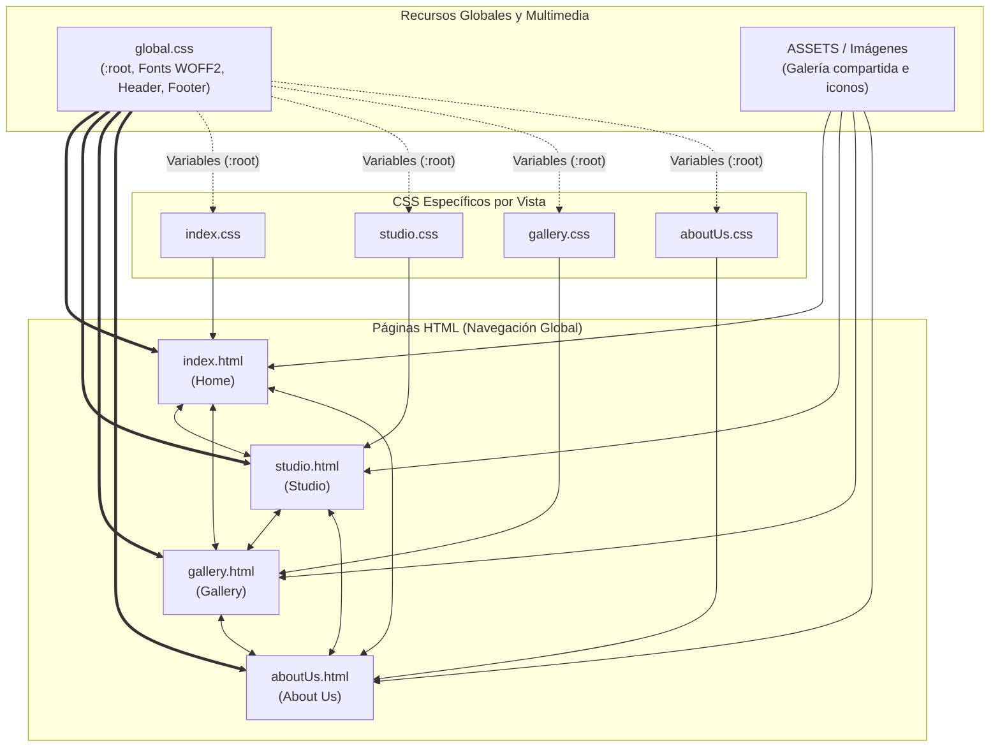

```mermaid
flowchart TD
    %% 1. Recursos Globales y Multimedia
    subgraph Global_Resources ["Recursos Globales y Multimedia"]
        GLOBAL["global.css\n(:root, Fonts WOFF2, Header, Footer)"]
        ASSETS["ASSETS / Imágenes\n(Galería compartida e iconos)"]
    end

    %% 2. Páginas HTML (Navegación cruzada entre todas)
    subgraph HTML_Pages ["Páginas HTML (Navegación Global)"]
        INDEX["index.html\n(Home)"]
        STUDIO["studio.html\n(Studio)"]
        GALLERY["gallery.html\n(Gallery)"]
        ABOUT["aboutUs.html\n(About Us)"]
    end

    %% 3. Hojas de Estilo Específicas por Página
    subgraph Specific_CSS ["CSS Específicos por Vista"]
        CSS_INDEX["index.css"]
        CSS_STUDIO["studio.css"]
        CSS_GALLERY["gallery.css"]
        CSS_ABOUT["aboutUs.css"]
    end

    %% Conexiones globales de global.css y ASSETS a todos los HTML
    GLOBAL ==> INDEX & STUDIO & GALLERY & ABOUT
    ASSETS --> INDEX & STUDIO & GALLERY & ABOUT

    %% Conexiones de global.css (variables/roots) hacia los CSS específicos
    GLOBAL -. "Variables (:root)" .-> CSS_INDEX & CSS_STUDIO & CSS_GALLERY & CSS_ABOUT

    %% Navegación bidireccional entre todas las páginas HTML
    INDEX <--> STUDIO
    INDEX <--> GALLERY
    INDEX <--> ABOUT
    STUDIO <--> GALLERY
    STUDIO <--> ABOUT
    GALLERY <--> ABOUT

    %% Conexiones exclusivas CSS específico -> Página correspondiente
    CSS_INDEX --> INDEX
    CSS_STUDIO --> STUDIO
    CSS_GALLERY --> GALLERY
    CSS_ABOUT --> ABOUT
```